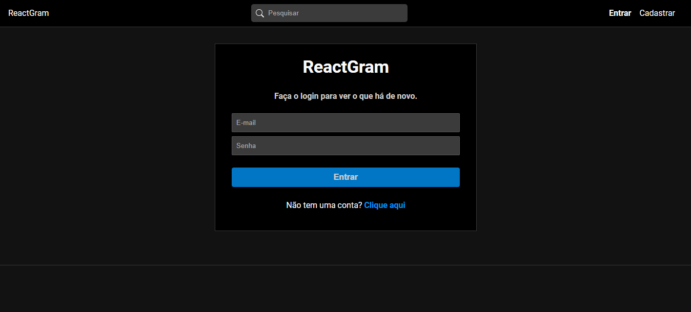

# ReactGram

Uma rede social de fotos feita com React no Front-end e MongoDB no Back-end

## Screenshots

## Aprendizados

React Router, Hooks, Context, MongoDB, Mongoose, Express, Redux

## Stack utilizada

**Front-end:** React, Styled Components

**Back-End:** MongoDB

## Autores

Made with 🧡 by:

- [@orvinicius](https://www.github.com/orvinicius)
